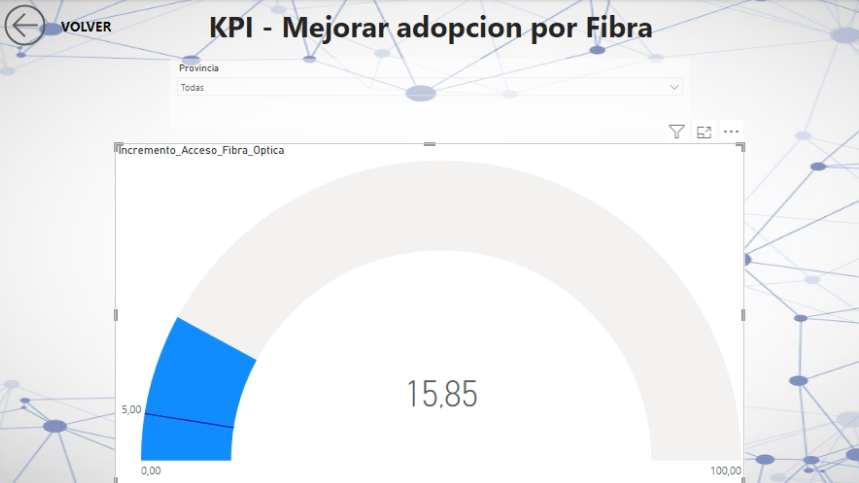
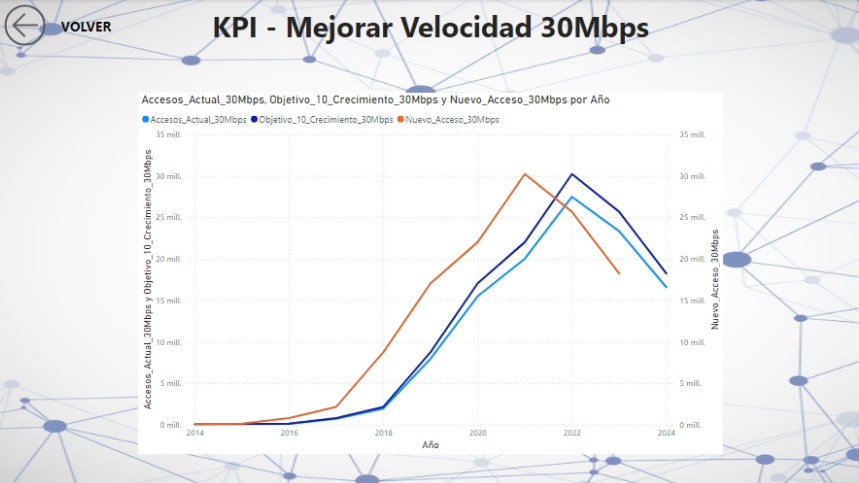

# Proyecto Data Analysis - Telecomunicaciones

## Tabla de contenidos

- [Introduccion](#introduccion)
- [Instalación y requisitos](#instalación-y-requisitos)
- [Fuentes de datos](#fuentes-de-datos)
- [Glosario](#glosario)
- [Estructura del proyecto](#estructura-del-proyecto)
- [Pasos para la instalación](#instalación-y-pruebas)
- [Herramientas](#herramientas-utilizadas)
- [Metodología](#metodología) 
- [KPI'S](#kpis)
- [Visualizaciones](#visualizaciones)
- [Algunas Conclusiones](#algunas-conclusiones)
- [Informacion de apoyo](#información-de-apoyo)
- [Contribución y colaboración](#contribución-y-colaboración)
- [Autores](#autores)

## Introducción

En este proyecto vamos a analizar y explorar un set de datos provenientes de ENACOM (ENTE NACIONAL DE COMUNICACIONES) de Argentina.
Nuestro primer paso sera trabajar con el archivo Internet.xlsx del cual vamos a eliminar y transformar algunas hojas que serán la fuente para nuestro análisis.

Como objetivo principal trabajaremos con esta fuente para, mediante un EDA (Análisis Exploratorio de Datos) brindarle a nuestro cliente a través de un Dashboard la información necesaria para conocer los posibles escenarios de inversión, sobre nuevas tecnologías e infraestructuras.

## Instalación y requisitos

* Python 3.11 o superior
* Pandas
* Matplotlib
* Seaborn
* Power BI

## Fuentes de datos

Las fuentes de datos que utilizamos para este proyecto fue seleccionar únicamente el archivo Internet.xlsx de la carpeta Data. 
Los archivos son provistos por ENACOM (Ente Nacional de Comunicaciones) de Argentina.

## Glosario

Descripción de las hojas:

* Velocidad % por prov: Distribución porcentual de la velocidad de conexión
a internet por provincia.
* Accesos Por Tecnología: Accesos a internet por tipo de tecnología.
* Penetracion-totales: Totales de penetración de internet.
* Penetración-poblacion: Penetración de internet en la población.
* Penetracion-hogares: Penetración de internet en hogares.
* Accesos por velocidad: Accesos a internet desglosados por velocidad de
conexión.
* Ingresos: Ingresos generados por los servicios de internet en miles de
pesos.

Definiciones de algunos términos claves:

* Accesos: Se refiere al número de conexiones a internet registradas. Estas
conexiones pueden ser a través de diversas tecnologías como ADSL, fibra
óptica, cable módem, etc.
* Penetración: Es el porcentaje de hogares o individuos que tienen acceso a
internet en una determinada área geográfica. Se puede medir en
términos de penetración en la población o en los hogares.

## Estructura del Proyecto

* En la raíz del repositorio tendrán:
* EDA.ipynb: Archivo que contiene el análisis exploratorio de datos del archivo Internet.xlsx.
* Data: Carpeta que contiene los archivos provistos por ENACOM. En nuestro caso solo usamos hojas del archivo Internet.xlsx, Internet_acotado.
* README.md: Archivo que contiene información e indicación sobre el Proyecto.
* Internet.pbix: Archivo que contiene el Dashboard realizado en Power BI. 

## Instalación y pruebas

1. Clonar repositorio: git clone https://github.com/lucho28/Telcom_DataAnalyst.git.
2. Recorrer el archivo EDA.ipynb para mas entendimiento del proyecto.
3. Ejecutar en Power BI el archivo internet.pbix.

## Herramientas utilizadas

* Se utilizaron las siguientes herramientas.
* Visual Studio Code.
* Github
* Microsoft Excel
* Microsoft Power BI

## Metodología

La metodología abordada en este proyecto fue seguir una serie de pasos por cada hoja del archivo Internet.xlsx.

Las hojas que se evaluaron son: 

* Velocidad % por prov
* Accesos Por Tecnología
* Penetracion-totales
* Penetración-poblacion
* Penetracion-hogares
* Accesos por velocidad
* Ingresos

El análisis que se realizo: 

* Buscar valores nulos.
* Buscar valores iguales a cero.
* Buscar valores duplicados. 
* Buscar valores atípicos.

Esto se hizo con cada una de las hojas para luego cerrar con algunas conclusiones y gráficos pertinentes.

Los valores atípicos de buscaron mediante gráficos (Boxplot). Teniendo en cuenta que era la mejor forma de representarlo.
También fueron acompañados, en ocasiones, por histogramas y scatterplot teniendo en cuenta que era necesario explicar ciertas dispersiones en los datos.

## KPI's

Se realizaron 3 KPS's relacionados con los accesos a internet:

1. KPI 1: Crecimiento de los accesos a velocidad +30 Mbps
2. KPI 2: Penetración de internet por hogar
3. KPI 3: Incremento total de accesos a internet

## Visualizaciones

Se realizo un Dashboard interactivo con la herramienta Power Bi. Dejamos el archivo en este repositorio con el nombre internet.pbix.

Detalle del Dashboard:

### Velocidad:

* Gráfico de lineas donde podemos ver la evolución a través de los años del acceso por velocidad.
* Gráfico de barras apiladas al 100% donde nos centramos en las 3 velocidades mas significativas, 10, 20 y 30 Mbps.

Esta hoja esta filtrada por provincia, trimestre y año.

### Tecnología:

* Gráfico de lineas que visualizan la evolución de las 3 tecnologías mas relevantes.
* Gráfico de barras para acompañar y comprender mejor la visualización.

Esta hoja contiene un filtro interactivo por provincia.

### Ingresos: En esta hoja hay 3 gráficos de lineas.

* Gráfico de linea que visualiza los ingresos totales a través de los años.
* Gráfico de linea que visualiza los ingresos por 3 tipos de tecnología. ADSL, Cablemodem y Fibra Óptica.
* Gráfico de linea que visualiza los ingresos de acceso por cada 100 habitantes.

### KPI_Penetracion:

* Aquí tenemos un KPI que mide el aumento del servicio para el próximo trimestre, cada 100 hogares por provincia. Tiene como objetivo aumentar 2%.

### KPI_Fibra: 

* KPI que mide el incremento de la tecnología Fibra óptica con un objetivo del 5% con respecto a las otras tecnologias.

### KPI_Velocidades:

* KPI que mide el incremento de la velocidad de 30 Mbps, teniendo como objetivo 10% anual.

## Algunas conclusiones

* Después de evaluar los datos provistos por ENACOM podemos ver que existen nichos para explorar posibles escenarios de inversión para nuevas tecnologías. Hay provincias que todavía están adoptando velocidades bajas de internet, y esto comparado con la tendencia general de las otras me hace pensar que debemos estudiar la situación socio-económica de dichas provincias para así ver posibles expansiones.

* Vimos de forma particular que provincias como Tierra del Fuego, San Luis, Chubut, son provincias que no tienen una buena adopcion por fibra, y por ende por velocidades mayores a 30Mbps.

## Información de apoyo

1. Crecimiento del Acceso a Internet durante la Pandemia
La pandemia de COVID-19 aceleró la adopción y expansión de tecnologías de Internet de alta velocidad. Con el aumento del trabajo remoto, la educación virtual y el entretenimiento en línea, la demanda por mejores conexiones creció drásticamente.

2. Fibra Óptica
Incremento de la Fibra Óptica: La fibra óptica es una tecnología que ha tenido un crecimiento significativo durante la pandemia. Esto se debe a su capacidad de ofrecer altas velocidades y anchos de banda estables. Desde 2020, muchas empresas y gobiernos han invertido fuertemente en su despliegue.
Ventajas: Mayor capacidad para transmitir datos a largas distancias sin pérdida de calidad, mejor estabilidad, y velocidades mucho más rápidas comparadas con otras tecnologías, como ADSL o Cable Modem.
Tasas de crecimiento: Según datos de varios informes de telecomunicaciones, el número de hogares conectados con fibra óptica ha crecido entre un 20-40% anual en muchos países durante los últimos años.

3. Cable Modem
Estabilidad del Cable Modem: Aunque el Cable Modem ha sido una tecnología popular durante décadas, su crecimiento se ha estabilizado, ya que ofrece menos ventajas frente a la fibra óptica.
Características: El Cable Modem se usa principalmente en redes híbridas de cable y fibra (HFC). Aunque puede ofrecer velocidades altas, su capacidad es limitada en comparación con la fibra óptica.
Tendencias recientes: Durante la pandemia, aunque todavía tiene una gran presencia, el número de conexiones nuevas a través de Cable Modem ha disminuido frente a la fibra.

4. Comparación de Evolución
Durante la pandemia (desde 2020), la fibra óptica ha crecido considerablemente, especialmente en áreas urbanas, donde la infraestructura se ha expandido más rápidamente.
Cable Modem, por otro lado, ha mantenido una base de usuarios estable, pero ha tenido menor crecimiento, ya que los usuarios han migrado hacia opciones más modernas como la fibra óptica para aprovechar las velocidades más rápidas y la baja latencia.

5. Tendencias Globales y Regionales
En muchos países, Latinoamérica incluida, el número de accesos a través de fibra óptica superó al de otras tecnologías a partir de 2021. Países como Argentina, Chile, y Brasil lideran la adopción de la fibra óptica.
En Europa y Asia, la fibra óptica ha estado presente desde hace más tiempo, pero la pandemia aceleró aún más la adopción.

6. Estadísticas en 2023:

Según datos recientes:

Fibra Óptica: Las conexiones con fibra crecieron a una tasa del 30% en 2021, alcanzando más del 50% del mercado en algunas regiones.
Cable Modem: Se mantuvo relativamente constante, con una ligera disminución en términos de nuevas conexiones frente a la fibra.
Conclusión:
La fibra óptica ha emergido como la tecnología dominante de conexión a Internet debido a su velocidad, estabilidad y la inversión en infraestructura que se aceleró desde la pandemia. Por otro lado, el Cable Modem sigue siendo una tecnología importante, aunque ha visto menos crecimiento comparado con la fibra.

Dispositivos por persona:

Algunos sondeos y revelamientos de datos arrojan que por persona, en Argentina, hay al menos 2 dispositivos.
Esto también depuesta la demanda constante de velocidad, de ancho de banda, y por ende de una infraestructura que la soporte.

## Contribución y colaboración

Los contribuidores son bienvenidos a reportar problemas, enviar solicitudes de funciones o enviar pull requests en el repositorio de GitHub. Antes de contribuir, por favor revisa las pautas de contribución en el archivo CONTRIBUTING.md.

## Autores:

Este proyecto fue realizado por:

* Nombre: Luis Gonzalez.
* Linkedin: www.linkedin.com/in/luis-gonzalez28/
* Mail: luedugonzalez@gmail.com
* Móvil: +54 9 2317-514044